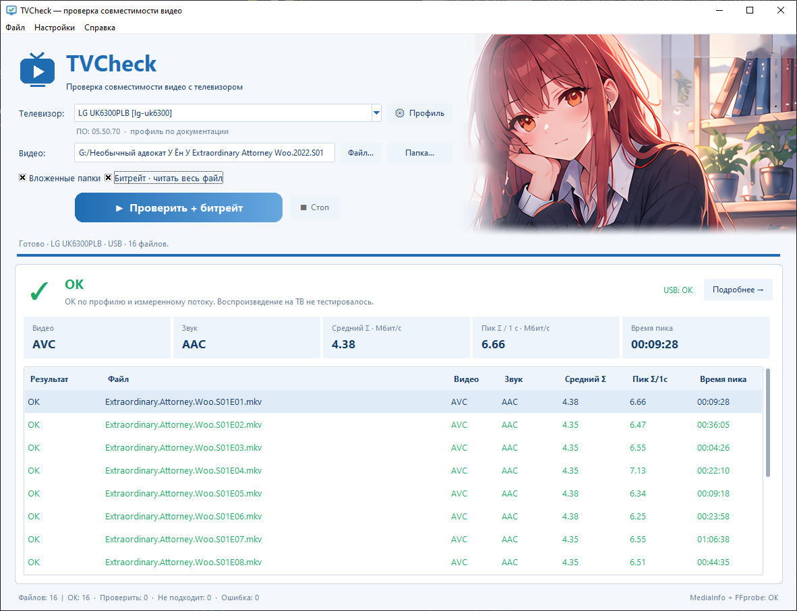
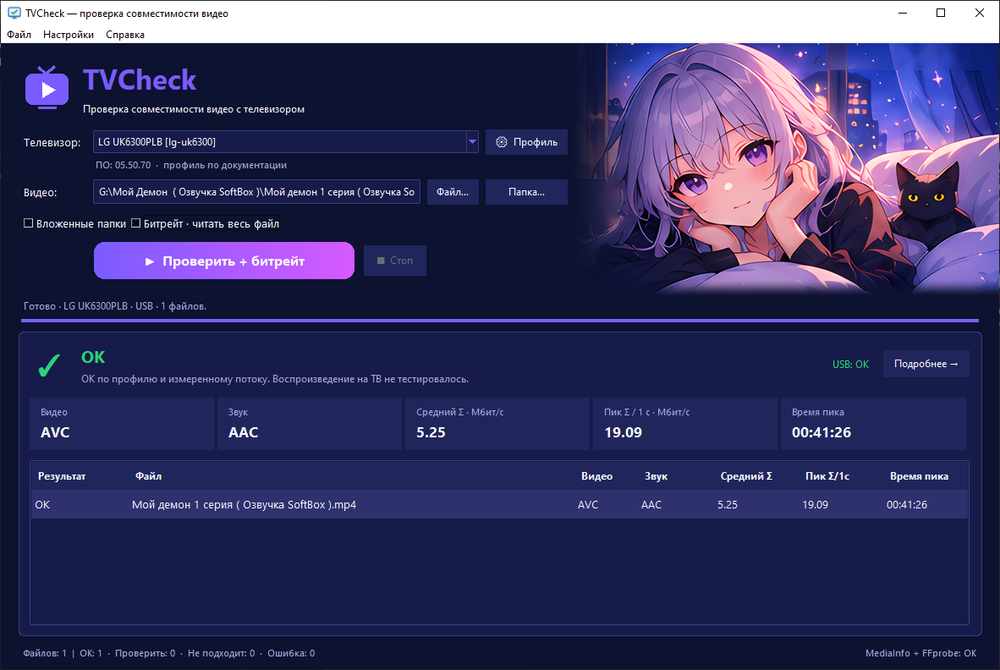
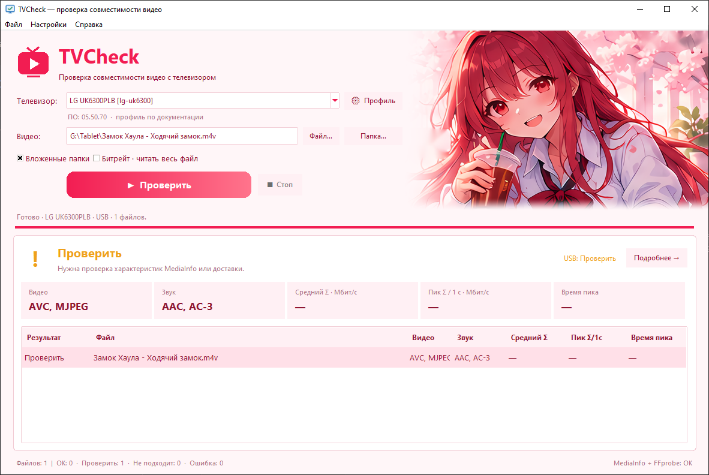
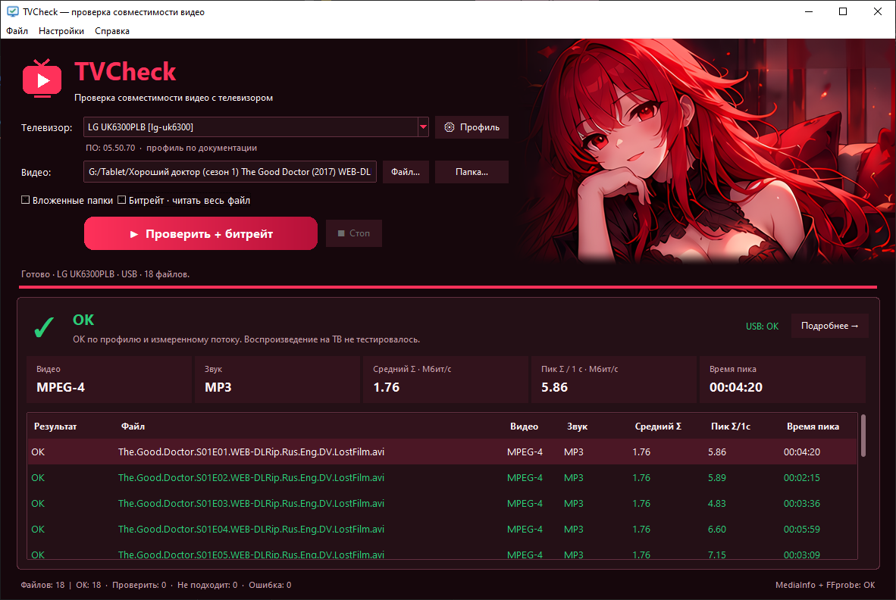
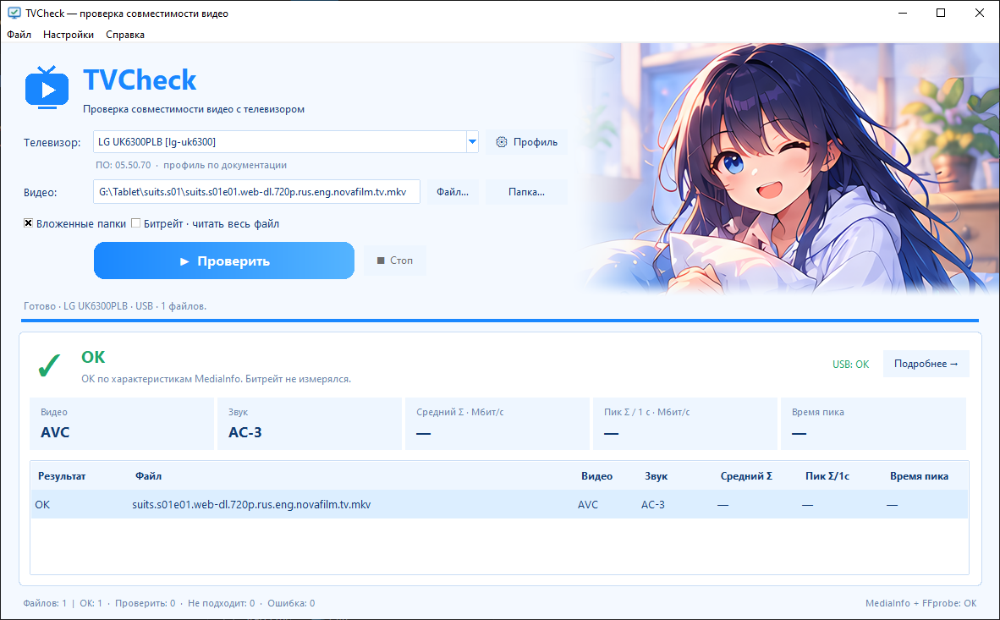

# TVCheck

TVCheck — Windows 10/11 x64 программа для оценки совместимости видеофайлов с телевизором. Она читает контейнер, видеодорожки, аудио, субтитры и ограничения профиля ТВ; по желанию измеряет средний и пиковый битрейт.

TVCheck **не конвертирует файлы**, не декодирует каждый кадр и не управляет DLNA-сервером. Оценка сети/DLNA — отдельная проверка по характеристикам файла и заданной скорости доставки, а не гарантия воспроизведения.


## Скриншоты

<p align="center">
  
</p>

<table>
  <tr>
    <td width="50%"></td>
    <td width="50%"></td>
  </tr>
  <tr>
    <td width="50%"></td>
    <td width="50%"></td>
  </tr>
</table>

## Скачать готовую программу

Откройте страницу [Releases](https://github.com/CB9TOIIIA/tvcheck/releases) и скачайте `TVCheck-Windows-x64.zip` из последнего релиза. Репозиторий содержит исходный код; запускать исходники для обычного использования не требуется.

Требования для готового архива:

- Windows 10/11 x64;
- Python, MediaInfo и FFmpeg устанавливать не нужно: MediaInfo CLI и FFprobe включены в архив;
- подключение к Интернету для работы не требуется.

## Использование мышью: установка и проводник

1. Скачайте ZIP и распакуйте **весь** архив в отдельную папку. EXE нельзя запускать прямо из ZIP.
2. Для обычной переносной работы дважды щёлкните `TVCheck.exe`.
3. Для установки в профиль текущего пользователя запустите `Install.cmd`. Администратор не нужен: программа копируется в `%LOCALAPPDATA%\Programs\TVCheck`, создаётся ярлык в меню «Пуск» и пункт контекстного меню Проводника.
4. В главном окне выберите профиль телевизора, файл или папку, затем нажмите `Проверить`.
5. Строку результата можно открыть двойным щелчком, клавишей Enter или кнопкой `Подробнее →`.
6. Для проверки файла или папки из Проводника используйте правую кнопку мыши → TVCheck. В Windows 11 пункт находится также в «Показать дополнительные параметры».
7. Для удаления используйте `Uninstall.cmd` или список установленных приложений Windows.

По умолчанию выполняется быстрая проверка MediaInfo и только USB-режим. Флажок `Битрейт · читать весь файл` включает чтение всего файла и измерение среднего/пикового потока; на больших файлах это может занять время.

### Проверка сети/DLNA

Она выключена по умолчанию. Включается в меню `Настройки → Проверка совместимости по DLNA/сети`. Это название специально означает проверку совместимости, а не наличие DLNA-функций в TVCheck.

После включения появляется выбор `USB / DLNA / сеть`, а отчёт показывает USB и сеть отдельно. TVCheck не проверяет DLNA-сервер, MIME-тип, direct play, серверное транскодирование и фактическую связь с телевизором.

### Настройки

- `Настройки → Оформление` — выбор темы, сохраняется между запусками.
- `Настройки → Профили телевизоров` — просмотр и импорт JSON-профилей.
- `Настройки → Скорость носителя / сети` — ввод измеренной устойчивой скорости в Мбит/с.
- `Настройки → Добавить в ПКМ` — регистрация меню Проводника для переносной копии.

## Использование через GUI

Главное окно рассчитано на последовательную проверку:

1. Выберите профиль телевизора. В комплекте есть документированный профиль LG UK6300PLB.
2. Перетащите файл/папку в поле выбора или нажмите кнопку выбора.
3. Оставьте `Вложенные папки`, если нужно проверить каталог рекурсивно.
4. При необходимости включите полное чтение файла. Без него результат не подтверждает измеренные пиковые значения.
5. Нажмите `Проверить`, дождитесь списка результатов и откройте подробности.
6. В подробностях смотрите вкладки видео, звук, `Битрейт / доставка` и субтитры.

Зелёный результат означает соответствие выбранному профилю и доступным измерениям, но не является гарантией работы конкретной прошивки, флешки, NAS или DLNA-сервера. Жёлтый и красный статусы перечисляют причины в деталях.

## Использование через терминал

Откройте PowerShell или `cmd.exe` в папке с программой. В готовом архиве запускайте `TVCheck.exe`:

```powershell
# Проверить папку в USB-режиме и вывести текстовый отчёт
.\TVCheck.exe --cli "D:\Movies"

# Проверить один файл в режиме DLNA/сеть, измерить битрейт и указать скорость доставки
.\TVCheck.exe --cli "D:\Movies\film.mkv" --mode network --link-mbps 70 --full

# Проверить только текущую папку без вложенных каталогов
.\TVCheck.exe --cli "D:\Movies" --quick --no-recursive

# Выбрать профиль и сохранить подробный JSON-отчёт
.\TVCheck.exe --cli "D:\Movies" --profile lg-uk6300 --json "D:\report.json"

# Проверить встроенные MediaInfo и FFprobe
.\TVCheck.exe --check-deps
```

Коды выхода CLI:

- `0` — все проверенные файлы совместимы;
- `1` — есть предупреждение;
- `2` — обнаружена несовместимость;
- `3` — ошибка, пустой список или ошибка зависимостей;
- `130` — отмена пользователем.

Без параметра `--cli` запускается обычное графическое окно. В Linux/macOS приложение и готовый архив не поддерживаются.

## Сборка из исходников

Исходники предназначены для Windows x64. Для сборки нужны Python 3.12+ с Tkinter, PowerShell и Git. Сторонние анализаторы скачиваются отдельно и не хранятся в истории Git из-за размера:

- [MediaInfo CLI x64](https://mediaarea.net/MediaInfo/Download/Windows);
- [FFprobe/FFmpeg Windows builds](https://www.gyan.dev/ffmpeg/builds/).

Положите `MediaInfo.exe` и `ffprobe.exe` в `tools/`, сохраните лицензии и notices из дистрибутивов, затем выполните:

```powershell
.\Build.ps1
```

Результат появится в `dist/TVCheck/`, ZIP — в `dist/TVCheck-Windows-x64.zip`. `dist/`, виртуальное окружение сборки и сторонние бинарники намеренно не коммитятся; ZIP прикрепляется к GitHub Release.

## Что опубликовано

В Git находятся исходники приложения (`*.py`), профили телевизоров, собственные runtime-ресурсы и темы из `assets/`, скрипты сборки/установки, документация и notices. Не публикуются в истории Git:

- сгенерированный PyInstaller-каталог `dist/`;
- локальная `.buildenv/` и `.build/`;
- крупные `MediaInfo.exe`, `ffprobe.exe` и DLL.

Готовый Windows-архив публикуется только как asset релиза. Лицензии сторонних компонентов и сведения о происхождении ресурсов находятся в [`THIRD_PARTY.txt`](THIRD_PARTY.txt).

## Лицензия

Собственный код и ресурсы TVCheck распространяются по [MIT License](LICENSE). Сторонние компоненты сохраняют собственные лицензии; см. [`THIRD_PARTY.txt`](THIRD_PARTY.txt) и notices внутри дистрибутива.
